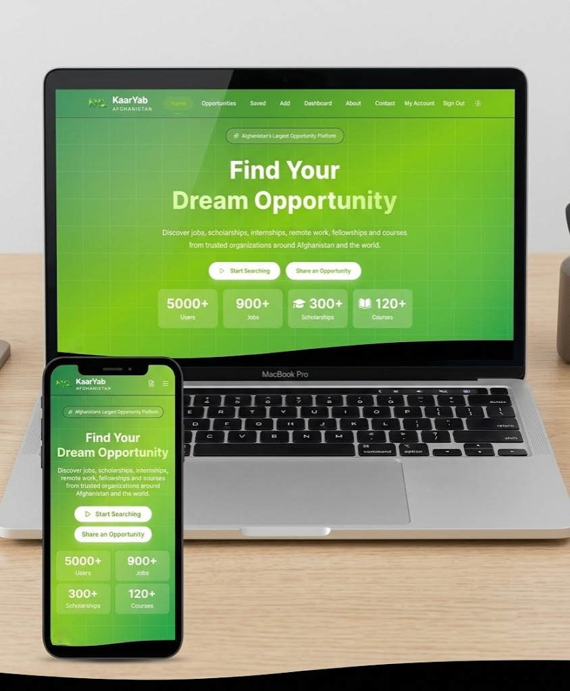

# 🇦🇫 KaarYab Afghanistan

<p align="center">
  
</p>

<p align="center">
A modern opportunity finder platform helping Afghan youth discover jobs, internships, scholarships, remote work, online courses, and career opportunities.
</p>

<p align="center">


</p>

---
## 📖 Project Overview

KaarYab Afghanistan is a modern web application developed with **Next.js** and **React** to simplify the process of finding educational and career opportunities.

The platform is designed to provide students, graduates, job seekers, and organizations with a clean and user-friendly interface where opportunities can be discovered, filtered, saved, and managed efficiently.

This project was developed as a **Final Capstone Project** using modern frontend technologies and best practices.

---

## 🎯 Problem Statement

Young people in Afghanistan often struggle to find reliable information about:

- Jobs
- Scholarships
- Internships
- Remote work
- Online courses
- Training programs

These opportunities are usually scattered across multiple websites and social media platforms.

KaarYab Afghanistan solves this problem by bringing everything together into one centralized platform with an intuitive and responsive interface.

---

# 👥 Target Users

- Students
- Fresh Graduates
- Job Seekers
- Women looking for Remote Opportunities
- Scholarship Applicants
- Internship Seekers
- Organizations sharing opportunities

---

# ✨ Features

## Opportunity Management

- Browse all opportunities
- Opportunity Details Page
- Featured Opportunities
- Recently Added Opportunities
- Opportunity Statistics

---

## Search & Filtering

Users can search and filter opportunities by:

- Title
- Organization
- Category
- Location
- Opportunity Type
- Deadline
- Tags

---

## Save Opportunities

Users can save their favorite opportunities using LocalStorage.

Saved opportunities remain available after refreshing the page.

---

## CRUD System

The application supports complete opportunity management:

- Create
- Read
- Update
- Delete

---

## Dashboard

Interactive dashboard including:

- Total Opportunities
- Active Opportunities
- Remote Opportunities
- Expiring Soon
- Category Charts
- Monthly Growth Chart
- Recent Opportunities Table

---

## CV Builder

A built-in CV management system allows users to:

- Create CV
- Edit CV
- Delete CV
- Download CV as PDF

---

## Responsive Design

Fully responsive layout optimized for:

- Desktop
- Tablet
- Mobile

---

## Dark Mode

Supports both:

- Light Theme
- Dark Theme

---

## UI Components

Professional reusable components including:

- Navbar
- Footer
- Cards
- Buttons
- Badges
- Empty States
- Loading States
- Charts
- Forms

---

# 🛠️ Technologies Used

## Framework

- Next.js 16 (App Router)

## Library

- React 19

## Language

- TypeScript

## Styling

- Tailwind CSS v4

## State Management

- React Context API

## Form Handling

- React Hook Form

## Validation

- Yup

## Animations

- Framer Motion

## Charts

- Recharts

## Icons

- Lucide React

## PDF Export

- html2pdf.js

## Utilities

- clsx
- tailwind-merge
- uuid
- date-fns

---

# 📂 Project Structure

```
app/
│
├── about/
├── contact/
├── dashboard/
├── opportunities/
│   └── [id]/
├── saved/
├── add-opportunity/
├── cv-builder/
└── page.tsx

components/
│
├── dashboard/
├── opportunity/
├── layout/
├── ui/
└── forms/

context/
│
├── OpportunityContext.tsx
└── CVContext.tsx

data/
│
└── opportunities.ts

types/
│
├── opportunity.ts
└── cv.ts

lib/
│
├── utils.ts
└── validation.ts
```

---

# 🚀 Main Functionalities

✔ Browse Opportunities

✔ Search Opportunities

✔ Filter Opportunities

✔ Save Opportunities

✔ Dashboard Statistics

✔ Opportunity CRUD

✔ Dynamic Routes

✔ CV Builder

✔ PDF Export

✔ Responsive Design

✔ Dark Mode

✔ Local Storage Persistence

---

# 📊 Dashboard Features

The dashboard provides insights including:

- Total Opportunities
- Active Opportunities
- Remote Opportunities
- Expiring Soon
- Opportunity Categories
- Monthly Growth
- Recent Opportunities

---

# 🎨 UI Highlights

- Modern Design
- Green Professional Theme
- Smooth Animations
- Reusable Components
- Consistent Spacing
- Accessible Interface
- Responsive Layout

---

# 💾 Data Storage

This project currently uses:

- LocalStorage
- Mock Data
- React Context API

No external database is required.

---

# 🔮 Future Improvements

The project can be extended with:

- Authentication
- Admin Panel
- Real Backend API
- Email Notifications
- Multi-language Support (English, Dari, Pashto)
- AI Opportunity Recommendation
- Company Profiles
- User Accounts
- Bookmark Sync
- Cloud Database
- Application Tracking

---

# ⚙️ Installation

Clone the repository

```bash
git clone https://github.com/your-username/kaaryab-afghanistan.git
```

Navigate into the project

```bash
cd kaaryab-afghanistan
```

Install dependencies

```bash
npm install
```

Run development server

```bash
npm run dev
```

Open

```
http://localhost:3000
```

---

# 📦 Build

```bash
npm run build
```

Run production build

```bash
npm start
```

---

# 🌍 Live Demo

Coming Soon

---

# 📸 Screenshots

Screenshots will be added after deployment.

---

# 📚 Learning Outcomes

This project demonstrates practical experience with:

- Next.js App Router
- React Hooks
- Context API
- TypeScript
- Form Validation
- Dynamic Routing
- State Management
- Responsive UI Design
- Component Architecture
- Modern Frontend Development

---

# 👩‍💻 Developer

**Amena Miri**

Computer Science Student

Graphic Designer

Frontend Developer

Afghanistan 🇦🇫

---

# 📄 License

This project was developed for educational purposes as a Final Capstone Project.