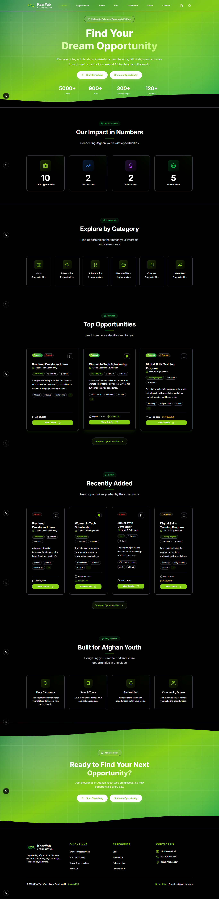
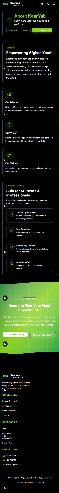
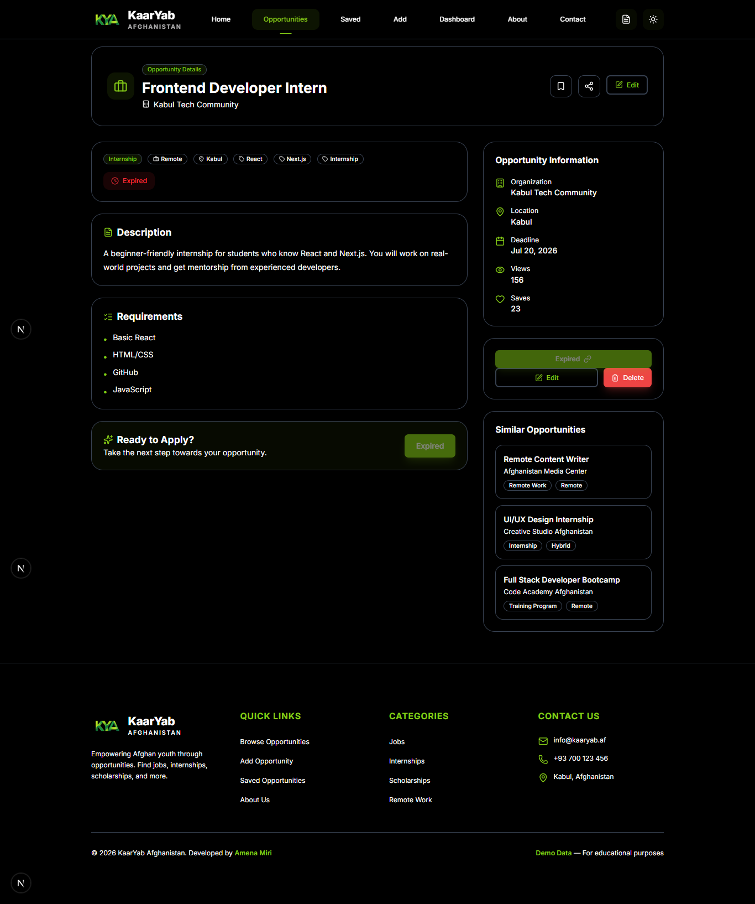
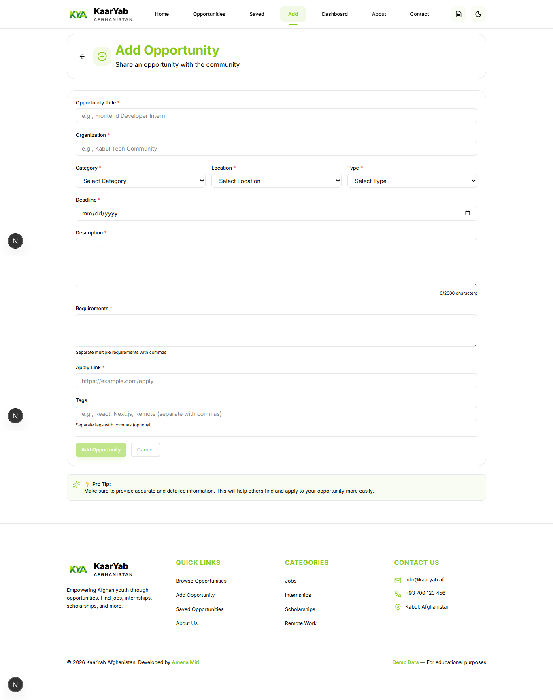
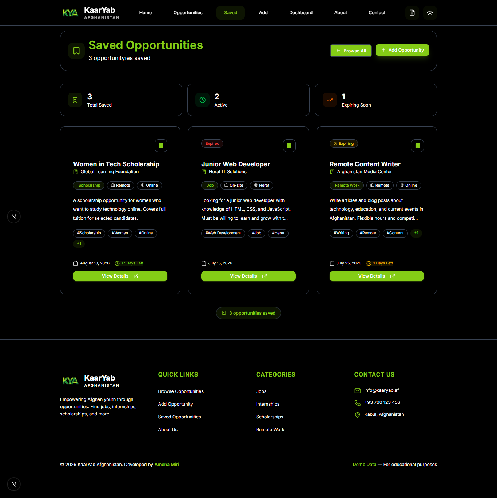
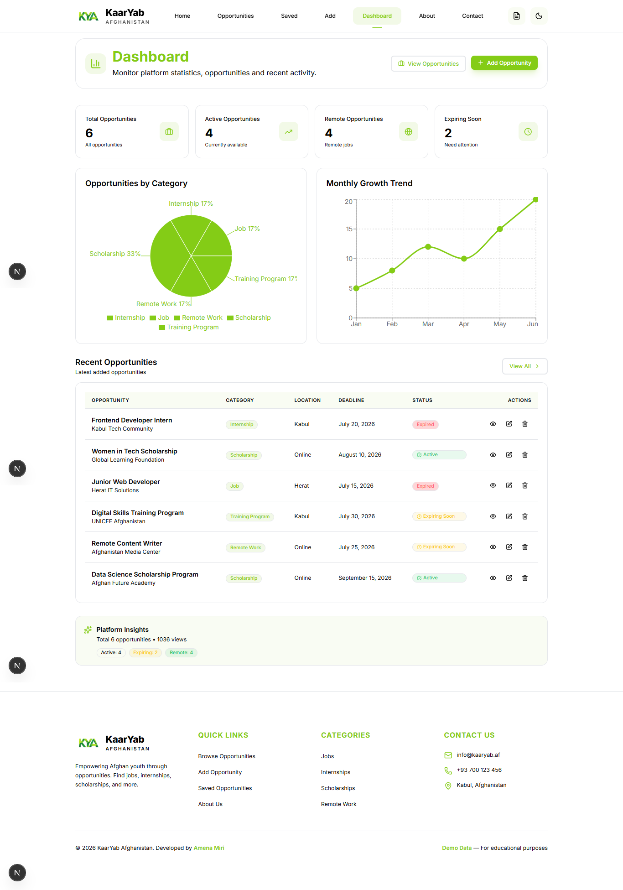
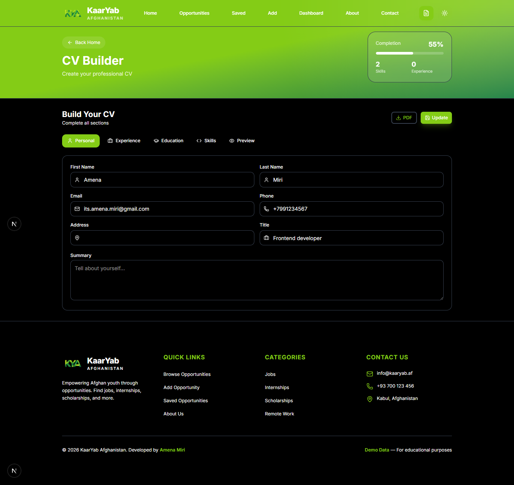
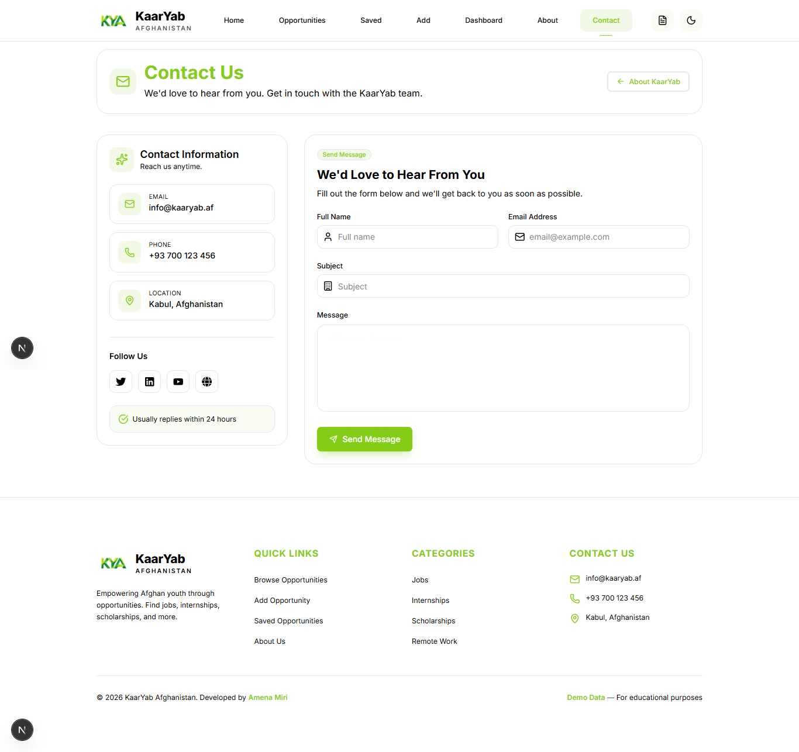
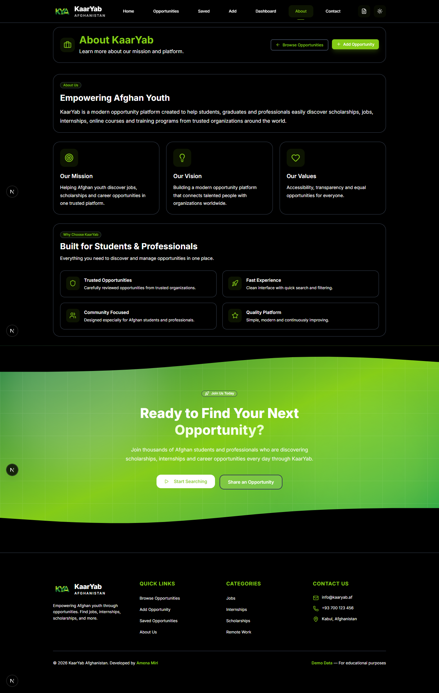
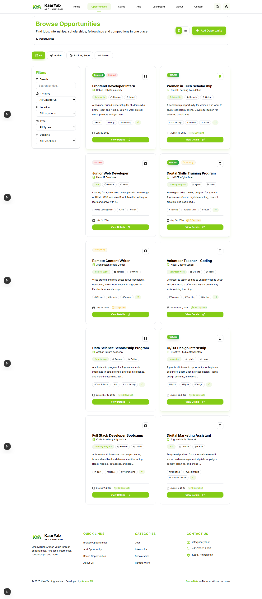

<h1 align="center">
  <span style="color:#84CC16;">KaarYab Afghanistan</span>
</h1>

<p align="center">
  
</p>

<p align="center">
<b>
A modern opportunity finder platform helping Afghan youth discover jobs, internships, scholarships, remote work, online courses, and career opportunities.
</b>
</p>


<p align="center">


</p>

---

# 📑 Table of Contents

- [Project Overview](#-project-overview)
- [Problem Statement](#-problem-statement)
- [Target Users](#-target-users)
- [Features](#-features)
- [Screenshots](#-screenshots)
- [Technologies Used](#-technologies-used)
- [Project Structure](#-project-structure)
- [Data Storage](#-data-storage)
- [Future Improvements](#-future-improvements)
- [Installation](#-installation)
- [Live Demo](#-live-demo)
- [Developer](#-developer)


---


# 📖 Project Overview

**KaarYab Afghanistan** is a modern opportunity finder platform built with:

- Next.js 16
- React 19
- TypeScript
- Tailwind CSS v4


The platform helps Afghan youth discover:

- Jobs
- Internships
- Scholarships
- Remote Work
- Online Courses
- Training Programs


Users can search, filter, save, and manage opportunities through a clean, responsive, and user-friendly interface.


This project was developed as a **Final Capstone Project** using modern frontend development practices.


---


# 🎯 Problem Statement

Many young people in Afghanistan face difficulties finding reliable information about:

- Career opportunities
- Scholarships
- Internships
- Remote jobs
- Learning resources


Information is usually scattered across different websites and social media platforms.

**KaarYab Afghanistan** solves this problem by creating a centralized platform where users can easily discover and manage opportunities in one place.


---


# 👥 Target Users

- 👨‍🎓 Students
- 🎓 Fresh Graduates
- 💼 Job Seekers
- 👩 Women Looking for Remote Opportunities
- 🎓 Scholarship Applicants
- 💻 Internship Seekers
- 🏢 Organizations Sharing Opportunities


---


# ✨ Features


## 📌 Opportunity Management

- Browse opportunities
- Featured opportunities
- Recently added opportunities
- Opportunity details page
- Opportunity statistics


## 🔍 Search & Filtering

Users can search and filter opportunities by:

- Title
- Organization
- Category
- Location
- Opportunity Type
- Deadline
- Tags


## ❤️ Save Opportunities

- Save favorite opportunities
- Saved opportunities page
- LocalStorage persistence


## 🔄 CRUD System

Complete opportunity management:

- Create opportunities
- Read opportunities
- Update opportunities
- Delete opportunities


## 📊 Dashboard

Interactive dashboard including:

- Total opportunities
- Active opportunities
- Remote opportunities
- Expiring soon opportunities
- Category statistics
- Charts
- Recent submissions


## 📄 CV Builder

Built-in CV management system:

- Create CV
- Edit CV
- Delete CV
- Preview CV
- Export CV as PDF


## 🎨 User Experience

- Responsive design
- Dark mode
- Light mode
- Loading states
- Empty states
- Error states
- Smooth animations


---
# 📸 Screenshots

<p align="center">
  Screenshots of the main pages of KaarYab Afghanistan platform.
</p>

<table>
  <tr>
    <td align="center">
      <b>🏠 Home Page</b>
      <br><br>
      
    </td>
    <td align="center">
      <b>📱 Mobile Design</b>
      <br><br>
      
    </td>
  </tr>

  <tr>
    <td align="center">
      <b>📄 Opportunity Details Page</b>
      <br><br>
      
    </td>
    <td align="center">
      <b>➕ Add Opportunity Page</b>
      <br><br>
      
    </td>
  </tr>

  <tr>
    <td align="center">
      <b>⭐ Saved Opportunities Page</b>
      <br><br>
      
    </td>
    <td align="center">
      <b>📊 Dashboard Page</b>
      <br><br>
      
    </td>
  </tr>

  <tr>
    <td align="center">
      <b>📑 CV Builder Page</b>
      <br><br>
      
    </td>
    <td align="center">
      <b>📞 Contact Page</b>
      <br><br>
      
    </td>

  </tr>

  <tr>
    <td align="center">
      <b>ℹ️ About Page</b>
      <br><br>
      
    </td>
    <td align="center">
      <b>💼 Opportunities Page</b>
      <br><br>
      
    </td>
  </tr>
</table>

---


# 🛠 Technologies Used


| Category | Technology |
|----------|------------|
| Framework | Next.js 16 (App Router) |
| Library | React 19 |
| Language | TypeScript |
| Styling | Tailwind CSS v4 |
| State Management | React Context API |
| Forms | React Hook Form |
| Validation | Yup |
| Charts | Recharts |
| Animation | Framer Motion |
| Icons | Lucide React |
| PDF Export | html2pdf.js |
| Utilities | clsx, tailwind-merge, uuid, date-fns |


---

# 📂 Project Structure

The project follows a clean and scalable Next.js App Router structure:

```text
app/
│
├── about/
├── contact/
├── dashboard/
├── api/
├── edit-opportunity/
├── opportunities/
│   └── [id]/
├── saved/
├── add-opportunity/
├── cv-builder/
├── globals.css
├── layout.tsx
└── page.tsx

components/
│
├── dashboard/
├── forms/
├── layout/
├── opportunity/
├── ui/
├── AppLoader.tsx
└── ThemeProvider.tsx

context/
│
├── OpportunityContext.tsx
└── CVContext.tsx

data/
└── opportunities.ts

types/
├── opportunity.ts
└── cv.ts

lib/
├── utils.ts
└── validation.ts
```

---

# 🚀 Main Functionalities

The application includes:

- ✅ Opportunity Management
- ✅ Search & Filtering
- ✅ Save Opportunities
- ✅ CRUD Operations
- ✅ Dynamic Routes
- ✅ Dashboard Analytics
- ✅ CV Builder
- ✅ PDF Export
- ✅ Dark Mode
- ✅ Responsive Design


---

# 🎨 UI Highlights

The platform provides:

- Modern professional interface
- Green-based brand identity
- Clean layout system
- Reusable components
- Smooth animations
- Responsive design
- Accessible user experience


---

# 💾 Data Storage

Currently, the application uses:

- LocalStorage
- Mock Data
- React Context API

No external database is required.


---

# 🔮 Future Improvements

Possible future improvements:

- User Authentication
- Admin Dashboard
- Real Backend API
- Database Integration
- Email Notifications
- Multi-language Support:
  - English
  - Dari
  - Pashto
- AI Opportunity Recommendation
- Company Profiles
- User Accounts
- Application Tracking System


---

# ⚙️ Installation

## Clone Repository

```bash
git clone https://github.com/amena-miri/kaaryab-afghanistan-.git
```

## Navigate Project

```bash
cd kaaryab-afghanistan
```

## Install Dependencies

```bash
npm install
```

## Run Development Server

```bash
npm run dev
```

Open browser:

```text
http://localhost:3000
```


---

## Live Demo

https://kaar-yab-afghanistan.vercel.app/

---

## GitHub Link:

https://github.com/Amena-Miri/KaarYab-Afghanistan-
---

# 📚 Learning Outcomes

This project demonstrates practical experience with:

- Next.js App Router
- React Hooks
- TypeScript
- Context API
- Form Validation
- Dynamic Routing
- State Management
- Responsive UI Design
- Component Architecture
- Modern Frontend Development


---

<div align="center">

# 👩‍💻 Developer

## **Amena Miri**

💻 Computer Science Student  
🎨 Graphic Designer  
⚡ Frontend Developer  

<br>


<br>

⭐ Built with passion for Afghan youth and future opportunities.

</div>


---

# 📄 License

This project was developed for educational purposes as a Final Capstone Project.